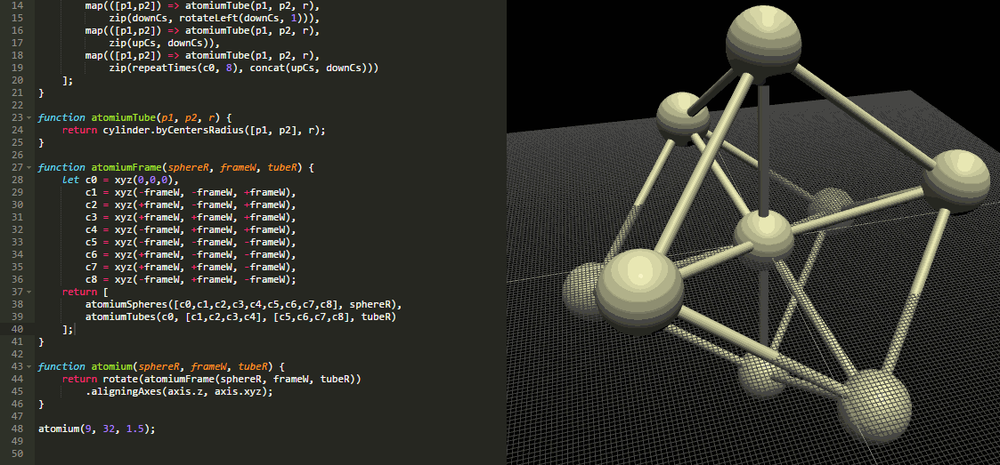
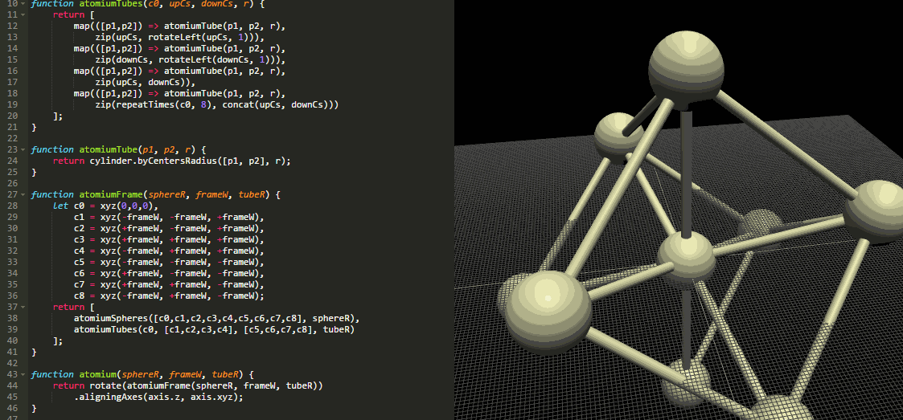
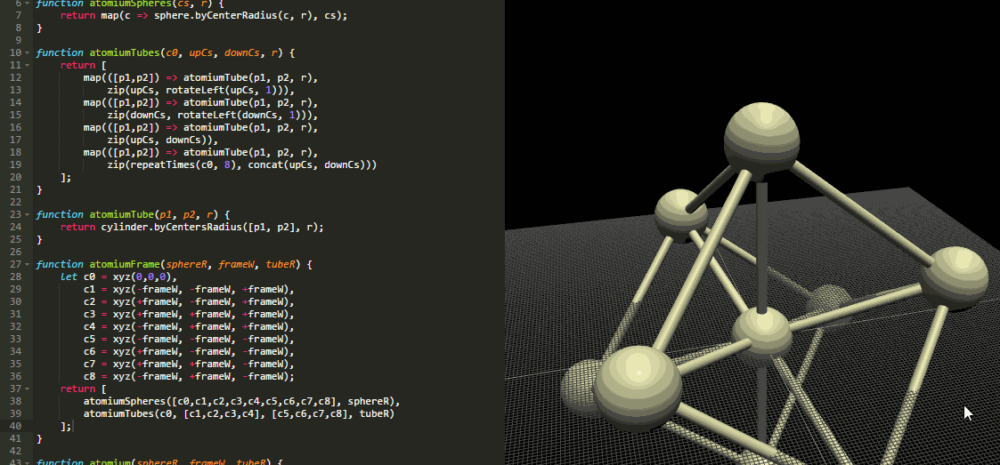

# The environment


## Displayed results
When the web page runs a program, it displays all the results of the expressions that are in the program's top-level.
Put simply, it displays results of expressions that are "outside of everything".

```javascript
function foo() {
  return sphere.byCenterRadius(xyz(0, 0, 0), 5);
}

foo();
```

After running the previous program, the environment shows the result of the last line, `foo();`.


## Running
The editor runs the program automatically after every change. This can be disabled by unchecking the _"Run automatically"_ checkbox. In this case, you can run the program by pressing the _"Run now"_ button.


## Literal adjustment
You can click and drag on any number in the source code to adjust its value. The editor does not change the amount of decimal digits of the number.

Dragging right increases; dragging left decreases.




## Traceability
If enabled, the editor highlights the results of functions under the mouse pointer. If the mouse is above an object in the 3D view, the editor highlights the function where it was created.

### From code to results


### From results to code



# From Racket to Javascript
## Identifiers
Javascript is similar to Processing and Python when it comes to identifiers.
Javascript identifiers can only contain alphanumeric characters (and also `$` and `\_`) and may not start with a digit.

Like so, valid identifiers in Racket may not be valid in Javascript.
For example, `polygon-surface` is not a valid Javascript identifier.


## Operators
Javascript supports a variety of operators like mathematical operators, `+ - * / %`, and logical operators, `! < <= > >= && ||`.
They are written in infix notation like in mathematical expressions, e.g. `1 + 1`.


## Functions
### Function declarations
```java
(define (square x) (* x x))

function square(x) {
  return x*x;
}
```

### Annonymous functions
```java
(lambda (x y) (sqrt (+ (* x x) (* y y))))

function(x, y) {
  return Math.sqrt(x*x + y*y);
}
// or
(x, y) => Math.sqrt(x*x + y*y)
```

### Function calls
```java
(square 2)

square(2)
```


## Variables
There three ways of declaring variables in Javascript:
`var`,`let` and `const`.
Variables declared with `var` are visible in the whole body of the function they are inside of.
```javascript
function func() {
  var aVar = "hello";
}
```
The variable `aVar` is only visible inside `func`.

`let` and `const` are only visible in the block where they were declared, i.e. the last pair of `{` and `}`.
`const` variables cannot be modified.

```javascript
function func() {
  const cAnswer = 42;
  let a = 10;
  cAnswer = 1000; // Error

}
```


## Control-flow
```javascript
if (/*condition*/) {/*then-body*/} else {/*else-body*/}
while (/*condition*/) {/*body*/}
do {/*body*/} while (/*condition*/);

for (/*variables*/; /*condition*/; /*variable update*/) {/*body*/}
for-in (/*variable*/ in /*javascript-object*/) {/*body*/}
for-of (/*variable*/ of /*javascript-iterable*/) {/*body*/}
```


# Defined functions and variables
## Geometric primitives
```java
(xyz)
point.byXYZ(x, y, z) vector.byXYZ(x, y ,z)
(cyl)
point.byCylindrical(r, th, z)
(sph)
point.bySpherical(r, th, phi)
(+c)
point.add(p1, p2) vector.add(v1, v2)
(-c)
point.sub(p1, p2) vector.sub(v1, v2)

(box)
box.byWidthHeightDepth = function(width, height, depth)
box.byCentersAxes = function([baseCenter, topCenter], [xVector, yVector])
box.byCentersWidthHeight = function([baseCenter, topCenter], [width, height])
box.byBottomWidthHeightZ = function(baseCenter, [width, height], z)
box.byCorners = function([pt1, pt2])
box.byCornerXYZ = function(pt, [x, y, z])

(sphere)
sphere.byRadius = function(radius)
sphere.byCenterRadius = function(vec, radius)

(cylinder)
cylinder.byRadiusHeight = function(radius, height)
cylinder.byCentersRadius = function([baseCenter, topCenter], radius)

(rectangle)
rectangle.surface.byCornerWidthHeight = function(corner, [width, height])

(polygon-surface)
polygon.surface.byVertices = function(vertices)

(extrusion)
extrusion.bySurfaceVector = function(surface, displacementVector)

(cone-frustum)
coneFrustum.byBottomRadiusTopRadius = function(bottom, botRadius, top, topRadius)
coneFrustum.byRadiusesHeight = function(botRadius, topRadius, height)
coneFrustum.byBottomTopRadiusesHeight = function(bottom, botRadius, topRadius, height)

(rotate)(x y z axis align)
rotate.aroundXByAngle(rad)(obj)
rotate.aroundAxisByAngle(axis, rad)(obj)
axis.byPointVector = function(point, vec)

(move)(x y z vector)
translate.byXYZ(x, y, z)(obj)
translate.byVector(vec)
```


## Lists (or Arrays)
```
'() -> []
(list elems...) -> [elems...]
(append lst1 lst2) -> sequence.concat(lst1, lst2)
                   -> [...lst1, ...lst2]
```

```java
sequence.map = function(fn, seq)
sequence.reduce = function(fn, seq, initialValue)
sequence.division = function(start, end, divisions, last)
sequence.cutInterval = function(a, b, n)
sequence.intervalDivision = function(a, b, n)
sequence.evenValsBetween = function(a, b, n)
sequence.intervalMiddles = function(a, b, segs)
sequence.count = function(n)
sequence.zip = function(...lists)
sequence.cartesianProduct = function(lst1, lst2)
sequence.rotateLeft = function(lst, offset)
sequence.rotate = rotateLeft
sequence.repeatTimes = function(elem, n)
sequence.interleave = function interleave(...lists)
sequence.concat = function(...lists)
sequence.length = function(lst)
sequence.drop = function(lst, n)
sequence.dropRight = function(lst, n)
```


## Math
```clojure
(random)
(exp)
(sqrt)
(log)
(cos)(sin)
```

Many math functions are exposed in `Math` standard object, for example:
```javascript
Math.random()
Math.exp()
Math.sqrt(x)
Math.log(x)
Math.cos(rad)
Math.sin(rad)
//etc
```
```java
math.lerp = function(a, b, t)
```

### Random specialized functions
```java
random.integer = function(upper)
random.integer.inRange = function(lower, upper)
random.real = function(upper)
random.real.inRange = function(lower, upper)
random.inRange = function(lower, upper)
```


## Operators
```java
functional.compose = function(...fns)
functional.cond = function(condPairs)
```


## Primitives in source files
You may want to look at function signtures, which are found in `src/SceneGraph/primitives.js`.
Anything passed to `registry.provide()` calls will be available to programs run by the environment.


# Debugging
## Using Browser Devtools
You may want to use the web browser's developer tools to debug your programs.

If using Google Chrome, you can open the devtools by pressing `F12`.
When Chrome has the devtools open, it will pause Javascript execution when it finds a `debugger;` statement.
