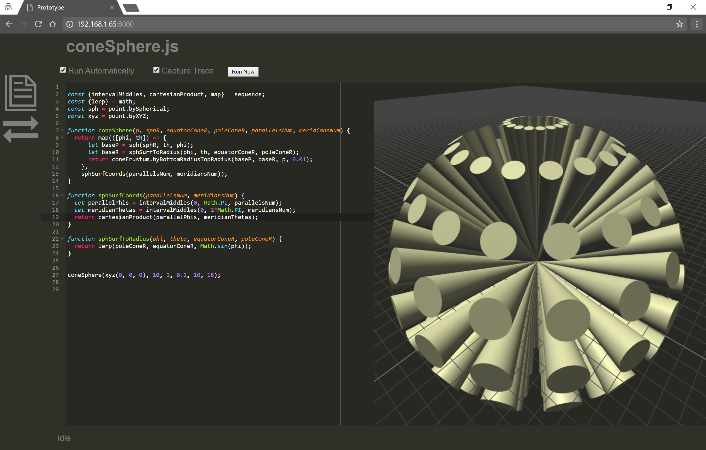
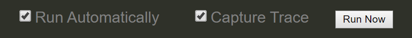
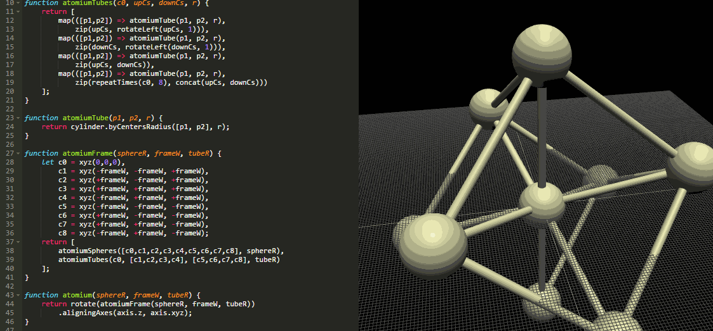
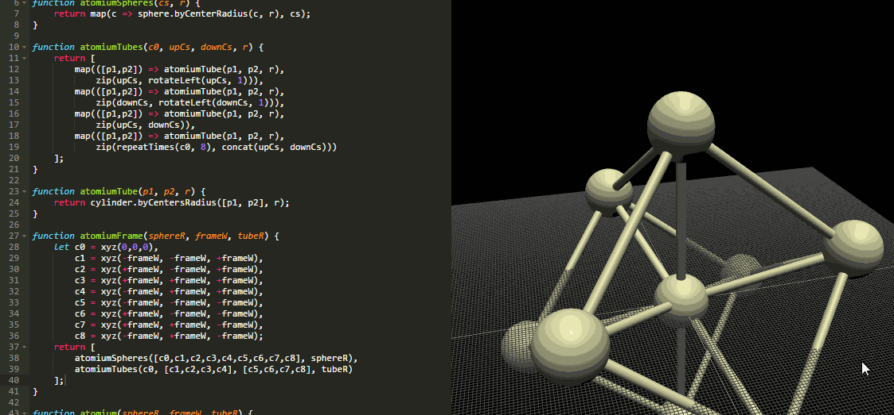
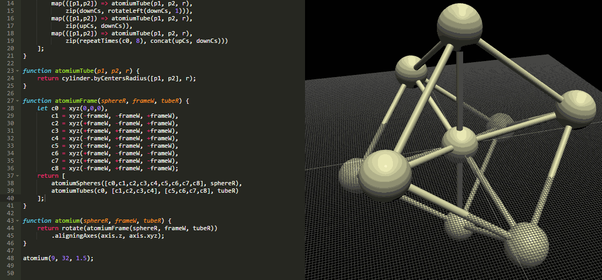

# The Luna Moth environment



## Results
When Luna Moth runs a program, it displays all results from expressions at the program's top-level, or put simply, it displays results of expressions that aren't inside of any function.

```javascript
function foo() {
  return sphere.byCenterRadius(xyz(0, 0, 0), 5);
}

foo();
```

After running the previous program, Luna Moth shows the result of the last line, `foo();`.
If `foo();` was returned from another function and that function wasn't called, then the result of ``foo()`` wouldn't be shown.


## Running controls
Luna Moth can run programs in slightly different ways.
By default, it will run them after every change. This can be disabled by unchecking the _"Run automatically"_ checkbox. In this case, you can run the program by pressing the _"Run now"_ button.

Luna Moth also collects traceability data by default when it runs programs. You can enable and disable this by using the _"Capture Trace"_ checkbox.




## Traceability
If enabled, the editor highlights the results of functions under the mouse pointer. If the mouse is above an object in the 3D view, the editor highlights the function where it was created.

### From code to results


### From results to code



## Literal adjustment
You can click and drag on any number in the source code to adjust its value. The editor does not change the amount of decimal digits of the number.

Dragging right increases; dragging left decreases.




# From Racket to Javascript
Luna Moth uses Javascript, a textual programming language like Racket.
Javascript syntax takes inspiration from the C programming language.
Unlike Racket, Javascript has more restrictions on how to use parenthesis. For example, curly braces (`{}`) can only be used in function definitions and for defining objects.

Like C and Racket, Javascript does not enforce any particular way of indenting its programs. Although programs can take any shape you want, you may want to follow some indentation rules yourself for the sake of readability. As a wise man once said:
>"With great power, comes great responsibility".

Javascript supports higher-order functions so it should be straightforward to translate Racket programs to Javascript.
Below are some remarks to have in mind if you are coming from Racket.


## Identifiers
Javascript is similar to Processing and Python when it comes to identifiers.
Javascript identifiers can only contain alphanumeric characters (and also `$` and `\_`) and may not start with a digit.

Like so, valid identifiers in Racket may not be valid in Javascript.
For example, `polygon-surface` is not a valid Javascript identifier.


## Operators
Javascript supports a variety of operators like mathematical operators, `+ - * / %`, and logical operators, `! < <= > >= && ||`.
They are written in infix notation like in mathematical expressions, e.g. `1 + 1`.


## Functions
### Function declarations
```java
(define (square x) (* x x))

// Remark: The result of functions is given by return statements.
// For example, "return x*x".
// Remark: Functions stop being evaluated when they finish
// a return statement.
function square(x) {
  return x*x;
}
```

### Annonymous functions
```java
(lambda (x y) (sqrt (+ (* x x) (* y y))))

// Just omit the function name in function declarations.
function(x, y) {
  return Math.sqrt(x*x + y*y);
}
// or use the arrow function syntax
(x, y) => Math.sqrt(x*x + y*y)
```

### Function calls
```java
(square 2)

// Just like calling a function in mathematics.
square(2)
```


## Variables
There three ways of declaring variables in Javascript:
`var`, `let` and `const`.
Variables declared with `var` are visible in the whole body of the function they are inside of.
`let` and `const` are only visible in the block where they were declared, i.e. the last pair of `{` and `}`.
`const` variables cannot be modified.
```javascript
function func() {
  var a = "hello";
  let b = "there";
  const c = 42;
  // a, b, and c can all be used inside of "func".
}
```

```javascript
function func() {
  const cAnswer = 1100;
  cAnswer = 1000; // Error: cannot modify "cAnswer"
  if (/* condition */) {
  	let deeperLet = "I'm inside!";
  }
  return deeperLet; // Error: "deeperLet" does not exist
}
```


## Control-flow
```javascript
if (/*condition*/) {/*then-body*/} else {/*else-body*/}
while (/*condition*/) {/*body*/}
do {/*body*/} while (/*condition*/);

for (/*variables*/; /*condition*/; /*variable update*/) {/*body*/}
for-in (/*variable*/ in /*javascript-object*/) {/*body*/}
for-of (/*variable*/ of /*javascript-iterable*/) {/*body*/}
```


# Predefined functions and variables
## Geometric primitives
```java
(xyz)
point.byXYZ(x, y, z) vector.byXYZ(x, y ,z)
(cyl)
point.byCylindrical(r, th, z)
(sph)
point.bySpherical(r, th, phi)
(+c)
point.add(p1, p2) vector.add(v1, v2)
(-c)
point.sub(p1, p2) vector.sub(v1, v2)
(selectors)
point.x = function(pt)
point.y = function(pt)
point.z = function(pt)
(vector operations)
vector.dot = function(v1, v2)
vector.cross = function(v1, v2)
vector.scale = function(vec, scalar)
vector.length = function(vec)
vector.normalized = function(vec)

(box)
box.byWidthHeightDepth = function(width, height, depth)
box.byCentersAxes = function([baseCenter, topCenter], [xVector, yVector])
box.byCentersWidthHeight = function([baseCenter, topCenter], [width, height])
box.byBottomWidthHeightZ = function(baseCenter, [width, height], z)
box.byCorners = function([pt1, pt2])
box.byCornerXYZ = function(pt, [x, y, z])

(sphere)
sphere.byRadius = function(radius)
sphere.byCenterRadius = function(vec, radius)

(cylinder)
cylinder.byRadiusHeight = function(radius, height)
cylinder.byCentersRadius = function([baseCenter, topCenter], radius)

(rectangle)
rectangle.surface.byCornerWidthHeight = function(corner, [width, height])

(polygon-surface)
polygon.surface.byVertices = function(vertices)

(extrusion)
extrusion.bySurfaceVector = function(surface, displacementVector)

(cone-frustum)
coneFrustum.byBottomRadiusTopRadius = function(bottom, botRadius, top, topRadius)
coneFrustum.byRadiusesHeight = function(botRadius, topRadius, height)
coneFrustum.byBottomTopRadiusesHeight = function(bottom, botRadius, topRadius, height)

(rotate)(x y z axis align)
rotate.aroundXByAngle(rad)(obj)
rotate.aroundAxisByAngle(axis, rad)(obj)
axis.byPointVector = function(point, vec)

(move)(x y z vector)
translate.byXYZ(x, y, z)(obj)
translate.byVector(vec)
```


## Lists (or Arrays)
```
'() -> []
(list elems...) -> [elems...]
(append lst1 lst2) -> sequence.concat(lst1, lst2)
                   -> [...lst1, ...lst2]
```

```java
sequence.map = function(fn, seq)
sequence.reduce = function(fn, seq, initialValue)
sequence.division = function(start, end, divisions, last)
sequence.cutInterval = function(a, b, n)
sequence.intervalDivision = function(a, b, n)
sequence.evenValsBetween = function(a, b, n)
sequence.intervalMiddles = function(a, b, segs)
sequence.count = function(n)
sequence.zip = function(...lists)
sequence.cartesianProduct = function(lst1, lst2)
sequence.rotateLeft = function(lst, offset)
sequence.rotate = rotateLeft
sequence.repeatTimes = function(elem, n)
sequence.interleave = function interleave(...lists)
sequence.concat = function(...lists)
sequence.length = function(lst)
sequence.drop = function(lst, n)
sequence.dropRight = function(lst, n)
```


## Math
```clojure
(random)
(exp)
(sqrt)
(log)
(cos)(sin)
```

Many math functions are exposed in `Math` standard object, for example:
```javascript
Math.random()
Math.exp()
Math.sqrt(x)
Math.log(x)
Math.cos(rad)
Math.sin(rad)
//etc
```
```java
math.lerp = function(a, b, t)
```

### Random specialized functions
```java
random.integer = function(upper)
random.integer.inRange = function(lower, upper)
random.real = function(upper)
random.real.inRange = function(lower, upper)
random.inRange = function(lower, upper)
```


## Operators
```java
functional.compose = function(...fns)
functional.cond = function(condPairs)
```


## Primitives in source files
You may want to look at function signtures, which are found in `src/SceneGraph/primitives.js`.
Anything passed to `registry.provide()` calls will be available to programs run by the environment.


# Debugging
## Using the web browser's Devtools
You may want to use the web browser's developer tools to debug your programs.

If using Google Chrome, you can open the devtools by pressing `F12`.
When Chrome has the devtools open, it will pause Javascript execution when it finds a `debugger;` statement.


# Closing comments
If you find that some information is missing, feel free to leave a comment or open an issue.
