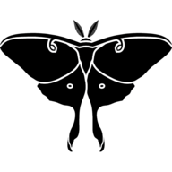

# Luna Moth - GD web environment
A Generative Design programming environment running in the web browser.

This project is in a really rough state so feel free to make any suggestions.

## Live demo
The Luna Moth live demo is here: [Luna Moth live demo](https://pafalium.github.io/gd-web-env/demo/index.html).

## Getting started
If already have the environment working, you may want to check the [instructions file](docs/instructions/instructions.md) to get started.

## Building
You need to have [node.js](https://nodejs.org/en/) and [gulp](http://gulpjs.com/) installed.

Then open up a console in the repository's root directory and run `npm install`. This will install all dependencies required for the web page itself and for the rest of the build process.

Run `gulp` to build the web page.

## Running
After the web page as been built, what remains is starting the server and opening up the environment.

You'll need to install [Racket](https://racket-lang.org/).

Afterwards, you need to install [Rosetta](https://github.com/aptmcl/rosetta) using Racket's package manager, Raco, or through DrRacket.

Finally, run `server/server.rkt` using Racket. It should open the index page in a web browser when it loads.

__Note:__ If you don't need to export to CAD, you can just use a static http server like `http-serve`.

